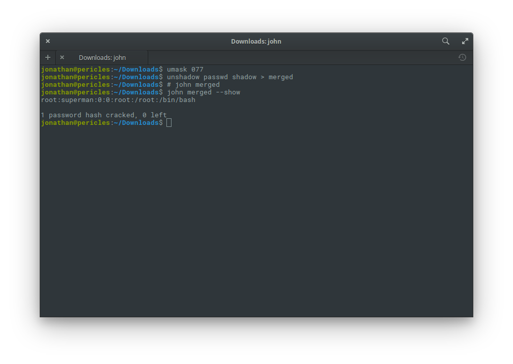

# HEEEEEEERE'S Johnny! [100pts]

Problem Description: Okay, so we found some important looking files on a linux computer. Maybe they can be used to get a password to the process. Connect with `nc 2018shell1.picoctf.com 38860`. Files can be found here: [passwd](https://2018shell1.picoctf.com/static/29633d1bd5ba677d6af455cf61b18f57/passwd) [shadow](https://2018shell1.picoctf.com/static/29633d1bd5ba677d6af455cf61b18f57/shadow).

Writeup: We are given two unix files and a port to connect to. We first start by connecting via netcat.

We can see that it prompts us for a username and then afterwords, a password. We'll have to use these two files to get us the password.

For this we can turn to [John The Ripper](https://www.openwall.com/john/). John is a password bruteforcer.

Unshadow merges the passwd and shadow files together when the filesystem is shadowed (which in this case is). You'd be running the commented out line, instead of `john merged --show`.

This gets us the password of **superman** for user **root**.

Let's connect to the remote again.

There's your flag. `picoCTF{J0hn_1$_R1pp3d_4e5aa29e}`