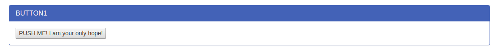
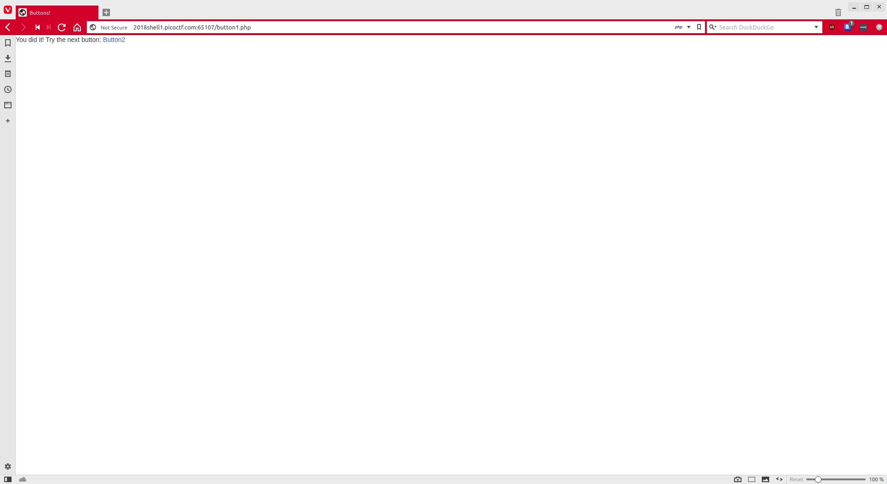
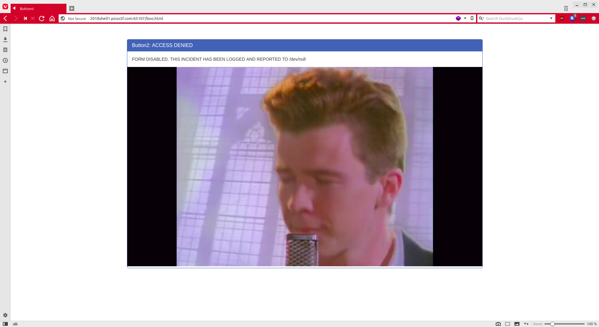
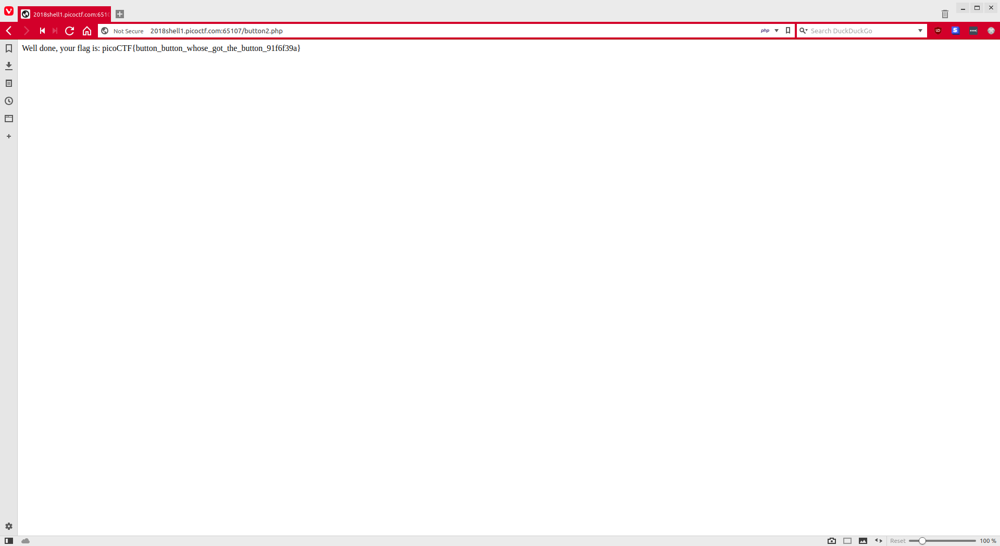

# Buttons [250pts]
Problem Description: There is a website running at http://2018shell1.picoctf.com:65107. Try to see if you can push their buttons.
Writeup: We go to the site.



We see this button and being the active user that we are, we decide to click it.


It tells us to try the next button so we do...



...and we get promptly trolled. Let's see why the second one didn't work. We'll compare the sources.

Source 1

```html
<!doctype html>
<html>
<head>
    <title>Buttons!</title>
    <link rel="stylesheet" type="text/css" href="//maxcdn.bootstrapcdn.com/bootstrap/3.3.5/css/bootstrap.min.css">
</head>
<body>
<div class="container">
    <div class="row">
        <div class="col-md-12">
            <div class="panel panel-primary" style="margin-top:50px">
                <div class="panel-heading">
                    <h3 class="panel-title">BUTTON1</h3>
                </div>
                <div class="panel-body">
                    <form action="button1.php" method="POST">
                        <input type="submit" value="PUSH ME! I am your only hope!"/>
                    </form>
                </div>
            </div>
        </div>
    </div>
</div>
</body>
</html>
```

Source 2
```html

<!doctype html>
<html>
<head>
    <title>Buttons!</title>
    <link rel="stylesheet" type="text/css" href="//maxcdn.bootstrapcdn.com/bootstrap/3.3.5/css/bootstrap.min.css">
</head>
<body>
<div>
    You did it! Try the next button: <a href="button2.php">Button2</a>
</div>
</body>
</html>
```

There's one huge difference here. Using the title of the problem as a hint, we realize that the first one is an actual button while the second is just a link. What if we changed it to a button? Being lazy, and not wanting to type a whole form element, we edit the original page instead, modifying the action parameter to button2.php.

```html
<form action="button2.php" method="POST">
```

Clicking the button now results in this:



There's your flag. `picoCTF{button_button_whose_got_the_button_91f6f39a}`