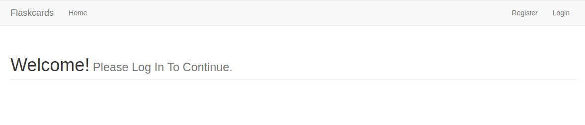
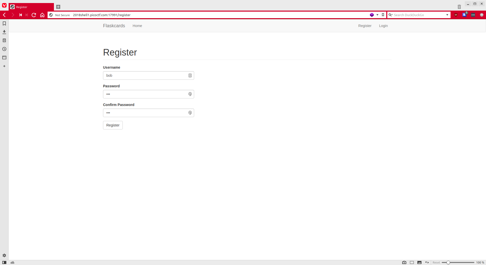
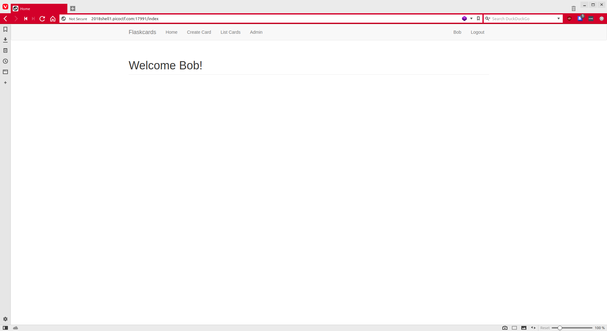
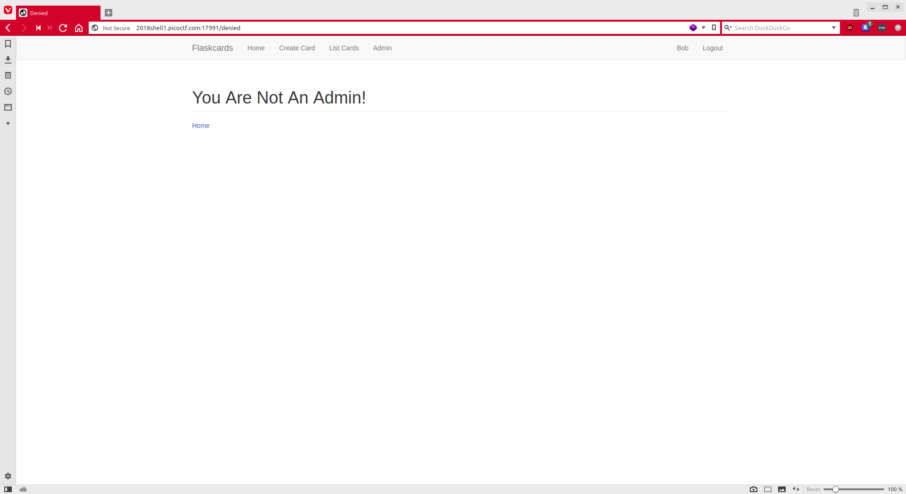
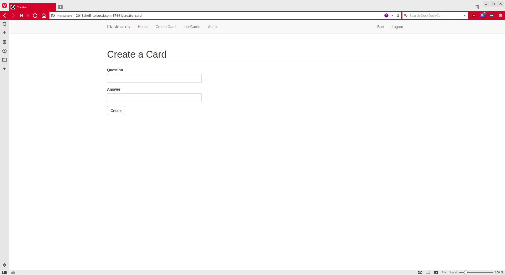
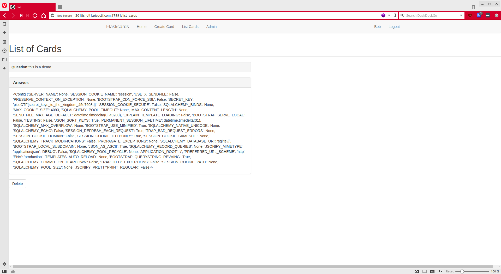

# Flaskcards [350pts]
> We found this fishy [website](http://2018shell1.picoctf.com:17991/) for flashcards that we think may be sending secrets. Could you take a look?

We navigate to the site to see this:



We don't have any login credentials and a brief check of the site's source, network requests, and cookies doesn't reveal anything. Let's register.



We login and are presented with this:



We'll first attempt the obvious and see if we can access that nice admin panel right there.



Nope. We'll have to resort to another endpoint. Let's try the "Create Card" page.



We see that there are two inputs, a question and answer. We'll play around a bit and refer to the title "Flask Cards". Given that there is a function "List Cards", it appears that we're inputting content that will get displayed. This means that the Flask server is using jinja, it's templating engine. We'll try SSTI (Server Side Templating Injection) and access the global variable config.

```jinja
{{ config }}
```

We'll insert that into the question or answer field, either will do.



... and boom. We get our env variable dump and our flag is among them.

`picoCTF{secret_keys_to_the_kingdom_45e7608d}`