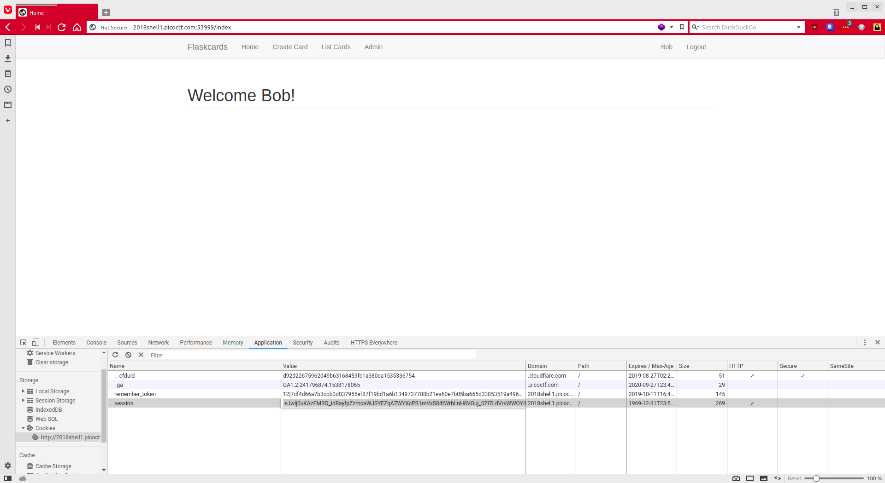
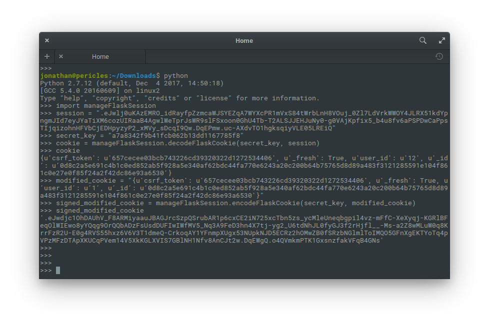
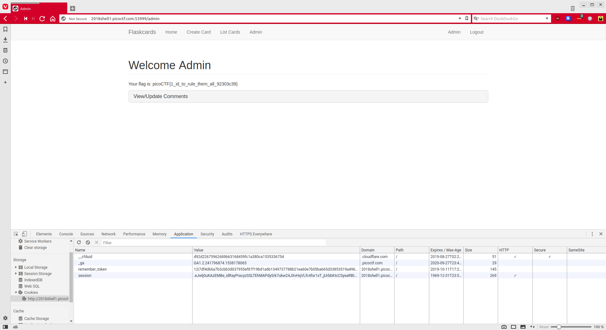

# Flaskcards Skeleton Key [600pts]
> Nice! You found out they were sending the Secret_key: a7a8342f9b41fcb062b13dd1167785f8. Now, can you find a way to log in as admin? http://2018shell1.picoctf.com:53999.

To solve this problem, we must have some basic knowledge of how Flask cookies work. A typical Flask application that has user authentication uses Flask's _sessions_ feature, which is essentially a JSON cookie that's cryptographically signed by itsdangerous, a python library. A non-signed cookie can by easily tampered with, as we see in [No Login](2018/picoCTF/web/no-login.md). The secret key is used by Flask to prevent this tampering, but since we have this key now as per [Flaskcards](2018/picoCTF/web/flask1.md), we can decrypt the cookie, tamper with it, and encrypt it once again.

We'll grab the session cookie.



We'll now decrypt it. There's a nice [gist](https://gist.github.com/aescalana/7e0bc39b95baa334074707f73bc64bfe) by [@aescalana](https://github.com/aescalana) that can easily do that for us.


``` JSON
{u'csrf_token': u'657cecee03bcb743226cd39320322d1272534406', u'_fresh': True, u'user_id': u'12', u'_id': u'0d8c2a5e691c4b1c0ed852ab5f928a5e340af62bdc44fa770e6243a20c200b64b75765d8d89a483f3121285591e104f861c0e27e0f85f24a2f42dc86e93a6530'}
```

We can see that there are several keys: `csrf_token`, `fresh`, `user_id`, and `_id`. We're not aiming for a cross site reference forgery attack so we can scratch that, and the `fresh` key is used to determine if a user is logged in or not, which shouldn't matter.

That leaves us with `user_id` and `_id`. `user_id` is simply a number while _id is a hash. `user_id` is thus much more easier to modify, which we'll do. Given that our `user_id` is 12, what'll the application do if we set `user_id` to 1?

We'll create a modified version:
``` python
modified_cookie = "{u'csrf_token': u'657cecee03bcb743226cd39320322d1272534406', u'_fresh': True, u'user_id': u'1', u'_id': u'0d8c2a5e691c4b1c0ed852ab5f928a5e340af62bdc44fa770e6243a20c200b64b75765d8d89a483f3121285591e104f861c0e27e0f85f24a2f42dc86e93a6530'}"
signed_modified_cookie = manageFlaskSession.encodeFlaskCookie(secret_key, modified_cookie)
```


We'll change the browser session cookie to this and request the admin endpoint.



There's your flag. `picoCTF{1_id_to_rule_them_all_92303c39}`

