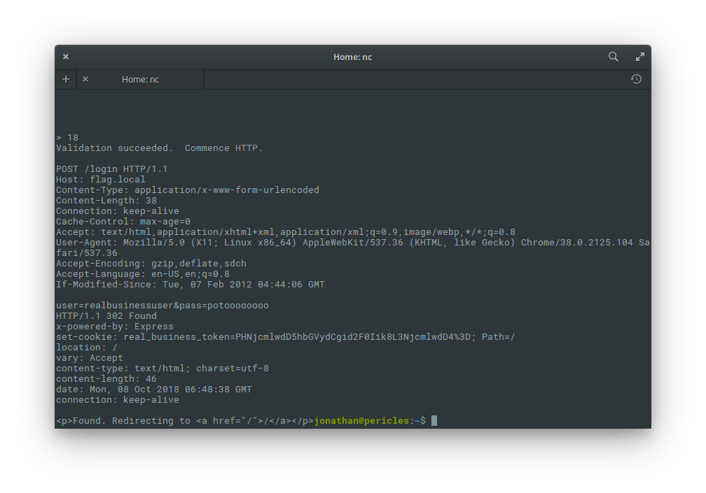
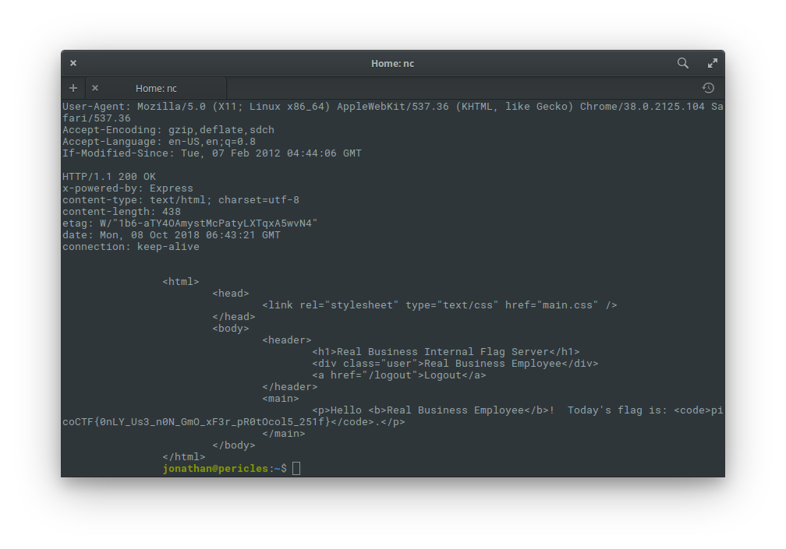

# Artisinal Handcrafted HTTP 3 [300pts]

Problem Description: We found a hidden flag server hiding behind a proxy, but the proxy has some... _interesting_ ideas of what qualifies someone to make HTTP requests. Looks like you'll have to do this one by hand. Try connecting via `nc 2018shell1.picoctf.com 33281`, and use the proxy to send HTTP requests to `flag.local`. We've also recovered a username and a password for you to use on the login page: \`realbusinessuser\`/\`potoooooooo\`.

Writeup: We'll first start by connecting.


We get a black input for an HTTP request. After fiddling around with it, we come to the conclusion that we can't simply send any ol HTTP request, we need to send the whole HTTP request with headers and message body. We consult the corresponding [RFC](https://www.rfc-editor.org/rfc/rfc7230.txt).

```
GET / HTTP/1.1
Host: flag.local
Connection: keep-alive
Cache-Control: max-age=0
Accept: text/html,application/xhtml+xml,application/xml;q=0.9,image/webp,*/*;q=0.8
User-Agent: Mozilla/5.0 (X11; Linux x86_64) AppleWebKit/537.36 (KHTML, like Gecko) Chrome/38.0.2125.104 Safari/537.36
Accept-Encoding: gzip,deflate,sdch
Accept-Language: en-US,en;q=0.8
If-Modified-Since: Tue, 07 Feb 2012 04:44:06 GMT
```

We'll make the connection to flag.local with this message body. The first three lines are most important.


We get an HTTP response back for the index page and can see its powered by express and won't give us a flag until we login.

We'll now have to submit a POST request to the login endpoint.

```
POST /login HTTP/1.1
Host: flag.local
Content-Type: application/x-www-form-urlencoded
Content-Length: 38
Connection: keep-alive
Cache-Control: max-age=0
Accept: text/html,application/xhtml+xml,application/xml;q=0.9,image/webp,*/*;q=0.8
User-Agent: Mozilla/5.0 (X11; Linux x86_64) AppleWebKit/537.36 (KHTML, like Gecko) Chrome/38.0.2125.104 Safari/537.36
Accept-Encoding: gzip,deflate,sdch
Accept-Language: en-US,en;q=0.8
If-Modified-Since: Tue, 07 Feb 2012 04:44:06 GMT

user=realbusinessuser&pass=potoooooooo
```

The Content-Type, Content-Length, and actual content are most important here. We'll send the request.



...and we get this. An HTTP 302 redirect response. We'll need to send a GET request to the root endpoint again. We do that and it fails because we're not logged in. The way around this is to set the cookie parameter to the cookie that the HTTP Response from the POST request sent. This leaves our final HTTP request at this:

```
GET / HTTP/1.1
Host: flag.local
Connection: keep-alive
Cookie: real_business_token=PHNjcmlwdD5hbGVydCgid2F0Iik8L3NjcmlwdD4%3D
Cache-Control: max-age=0
Accept: text/html,application/xhtml+xml,application/xml;q=0.9,image/webp,*/*;q=0.8
User-Agent: Mozilla/5.0 (X11; Linux x86_64) AppleWebKit/537.36 (KHTML, like Gecko) Chrome/38.0.2125.104 Safari/537.36
Accept-Encoding: gzip,deflate,sdch
Accept-Language: en-US,en;q=0.8
If-Modified-Since: Tue, 07 Feb 2012 04:44:06 GMT
```

We run it.



There's your flag. `picoCTF{0nLY_Us3_n0N_GmO_xF3r_pR0tOcol5_251f}`