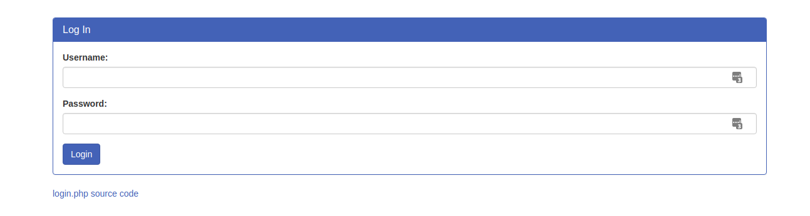
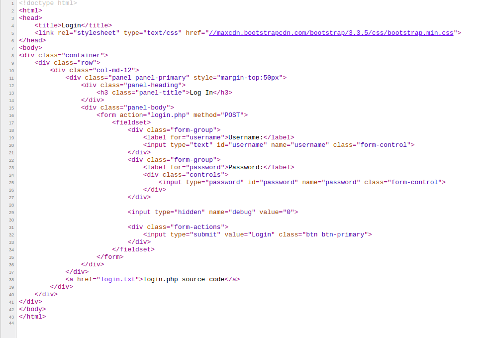
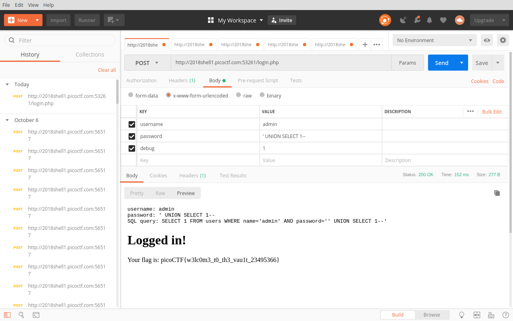

# The Vault [250pts]
Problem Description: There is a website running at http://2018shell1.picoctf.com:53261. Try to see if you can login!

Writeup: We'll first visit the site.



We'll do the obligatory look at the source.



We see nothing out of the normal and proceed to look at the **login.php** source provided to us.

``` php
<?php
  ini_set('error_reporting', E_ALL);
  ini_set('display_errors', 'On');

  include "config.php";
  $con = new SQLite3($database_file);

  $username = $_POST["username"];
  $password = $_POST["password"];
  $debug = $_POST["debug"];
  $query = "SELECT 1 FROM users WHERE name='$username' AND password='$password'";

  if (intval($debug)) {
      echo "<pre>";
      echo "username: ", htmlspecialchars($username), "\n";
      echo "password: ", htmlspecialchars($password), "\n";
      echo "SQL query: ", htmlspecialchars($query), "\n";
      echo "</pre>";
      }

  //validation check
  $pattern ="/.*['\"].*OR.*/i";
  $user_match = preg_match($pattern, $username);
  $password_match = preg_match($pattern, $username);
  if($user_match + $password_match > 0)  {
  	echo "<h1>SQLi detected.</h1>";
  }
  else {
       $result = $con->query($query);
       $row = $result->fetchArray();
       if ($row) {
       	  echo "<h1>Logged in!</h1>";
	  echo "<p>Your flag is: $FLAG</p>";
       } else {
	  echo "<h1>Login failed.</h1>";
       }
  }
?>
```

We can see that the flag is stored as a variable in the **config.php** file. It looks like in order to login we'll have to use SQL injection. We see that the main problem will be these three lines:

``` php
    $pattern ="/.*['\"].*OR.*/i";
    $user_match = preg_match($pattern, $username);
    $password_match = preg_match($pattern, $username);
```

The portal is using RegEx to sanitize the input. We can see that if we try to use any statement with a \` followed by an `OR` we'll get redirected to the message **SQLI detected.**

We'll take advantage of the debug parameter that picoCTF gratiously provided us, and try a nice ol `UNION SELECT` since that avoids using the `OR`.

We'll fire up Postman and attempt a POST request.



There's your flag. `picoCTF{w3lc0m3_t0_th3_vau1t_23495366}`